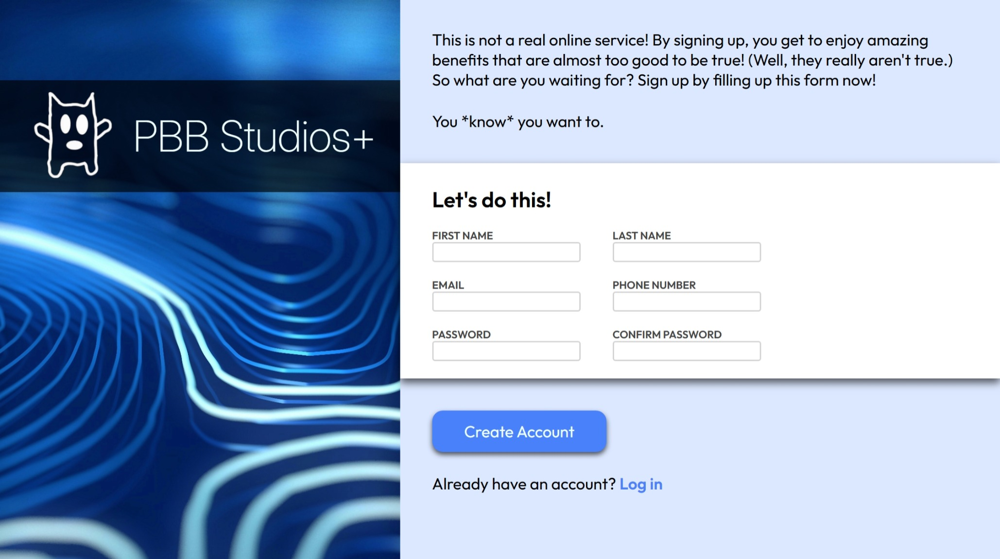

# sign-up-form
Sign-up form project based on The Odin Project curriculum

Live demo link: https://j0e-quan.github.io/sign-up-form/

## Technologies used:
 - HTML for basic layout of page and form creation
 - CSS for styling elements and use of web fonts (Inter for logo text, Outfit for body text)
 - Flexbox for arranging elements
 - Git for version control

## Key features:
 - Beautiful layout organised with Flexbox
 - Form for recieving input featuring adaptive look based on validity of input

## Credits:
 - Photo by <a href="https://unsplash.com/@vladpatana?utm_source=unsplash&utm_medium=referral&utm_content=creditCopyText">Vlad Patana</a> on <a href="https://unsplash.com/photos/a-close-up-of-a-blue-and-white-pattern-mhzlqhafUJg?utm_source=unsplash&utm_medium=referral&utm_content=creditCopyText">Unsplash</a>
      
## Gallery:
